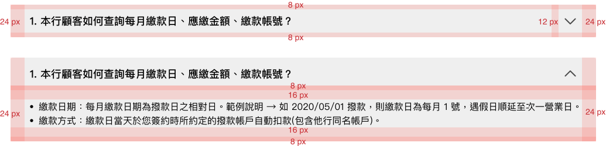
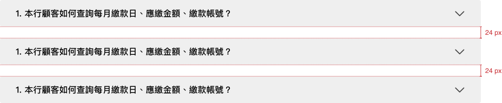
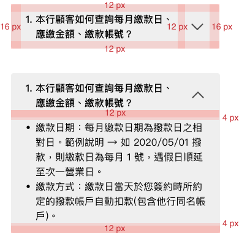
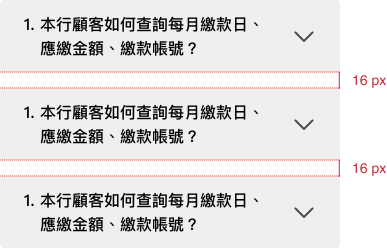

# Accordion 手風琴
> 主要用途是在單一頁面中有效管理和展示大量、分區塊的內容，透過點擊標題來展開/收合相關內容，常應用於常見問題(FAQ)、產品規格、多層次選單等場景。 

<script setup>
  import Accordion from '../components/Accordion.vue'
</script>

## 元件預覽
<Accordion />

## 程式碼
::: code-group

```html [html]
<!-- gray可更換成white、line變成不同樣式 -->
  <div class="l-accordion gray">
    <div class="l-accordion--item">
      <div class="l-accordion--title"><div><span class="num">1.</span>本行顧客如何查詢每月繳款日、應繳金額、繳款帳號？</div><svg width="40" height="40" viewBox="0 0 40 40" fill="none" xmlns="http://www.w3.org/2000/svg"><g clip-path="url(#clip0_2200_517)"><path d="M28.534 16.415L19.974 24.975L11.414 16.415" stroke="#000000" stroke-width="2" stroke-linecap="round" stroke-linejoin="round"/></g><defs><clipPath id="clip0_2200_517"><rect width="19.949" height="10.975" fill="white" transform="translate(10 15)"/></clipPath></defs></svg>
      </div>
      <div class="l-accordion--content">
        <ul>
          <li>繳款日期：每月繳款日期為撥款日之相對日。範例說明 → 如 2020/05/01 撥款，則繳款日為每月 1 號，遇假日順延至次一營業日。</li>
          <li>繳款方式：繳款日當天於您簽約時所約定的撥款帳戶自動扣款(包含他行同名帳戶)。</li>
        </ul>
        <p>其他事項</p>
      </div>
    </div>
  </div>
  <div class="l-accordion gray">
    <div class="l-accordion--item">
      <div class="l-accordion--title"><div><span class="num">2.</span>本行顧客如何查詢每月繳款日、應繳金額、繳款帳號？</div><svg width="40" height="40" viewBox="0 0 40 40" fill="none" xmlns="http://www.w3.org/2000/svg"><g clip-path="url(#clip0_2200_517)"><path d="M28.534 16.415L19.974 24.975L11.414 16.415" stroke="#000000" stroke-width="2" stroke-linecap="round" stroke-linejoin="round"/></g><defs><clipPath id="clip0_2200_517"><rect width="19.949" height="10.975" fill="white" transform="translate(10 15)"/></clipPath></defs></svg>
      </div>
      <div class="l-accordion--content">
        <ul>
          <li>繳款日期：每月繳款日期為撥款日之相對日。範例說明 → 如 2020/05/01 撥款，則繳款日為每月 1 號，遇假日順延至次一營業日。</li>
          <li>繳款方式：繳款日當天於您簽約時所約定的撥款帳戶自動扣款(包含他行同名帳戶)。</li>
        </ul>
        <p>其他事項</p>
      </div>
    </div>
  </div>
```

```css [css]
.l-accordion{
    width: 90%;
    max-width: 1000px;
    padding: 0px 16px;
    border-radius: 4px;
    margin-bottom: 16px;
}
.l-accordion:last-child{
    margin-bottom: 0px;
}
.l-accordion--title{
    padding: 12px 0px;
    font-size: 16px;
    font-weight: bold;
    display: flex;
    justify-content: space-between;
    align-items: center;
    cursor: pointer;
}
.l-accordion--title > div{
    display: flex;
    margin-right: 12px;
}
.l-accordion--title .num{
    margin-right: 4px;
}
.l-accordion--title svg{
    flex-shrink: 0;
    width: 40px;
    height: 40px;
    transition: 0.5s;
}
.l-accordion--title svg.rotate{
    transform: rotate(180deg);
}
.l-accordion--content{
    padding: 4px 0 16px 0px;
    display: none;
}
.l-accordion--content ul,.l-accordion--content p{
    margin: 0px;
}
.l-accordion.gray{
    background-color: #EFEFEF;
}
.l-accordion.white{
    background-color: #fff;
}
.l-accordion.white .l-accordion--title{
    color: #00a19b;
}
.l-accordion.line{
    background-color: #fff;
    border: solid 1px #00a19b;
}
.l-accordion.line .l-accordion--title{
    color: #00a19b;
}
.l-accordion.line .l-accordion--title svg path{
    stroke: #00a19b;
}
@media (min-width: 992px){
    .l-accordion{
        padding: 0px 24px;
        margin-bottom: 24px;
    }
    .l-accordion:last-child{
        margin-bottom: 0px;
    }
    .l-accordion--title{
        font-size: 18px;
        padding: 8px 0px;
    }
    .l-accordion--content{
        padding: 16px 0 24px 0px;
    }
}
```
```js [js]
$('.l-accordion--title').click(function(){
    $(this).siblings('.l-accordion--content').slideToggle()
    $(this).find('svg').toggleClass('rotate')
})
```
:::

## 元件規範

<div class="table-responsive">
    <table class="table table-bordered w1000">
        <thead class="bg-primary-8">
            <tr>
                <th scope="col"></th>
                <th scope="col" colspan="3">(>992px)</th>
            </tr>
        </thead>
        <tbody>
            <tr>
                <td rowspan="2" class="bg-primary-2" scope="row">
                    <p class="text-gray-11">:defualt</p>
                </td>
                <td>
                    
                </td>
            </tr>
            <tr>
                <td colspan="3">
                    <b>共同樣式</b>
                    <ul class="pl-3 my-1">
                        <li>箭頭icon：40x40px</li>
                        <li>標題：font-size:18px/font-weight:bold</li>
                        <li>內容：font-size:16px</li>
                        <li>border-radious:4px</li>
                    </ul>
                    <b>個別樣式</b><br>
                    <b>Accordion_Gray</b>
                    <ul class="pl-3 my-1">
                        <li>background-color：#efefef</li>
                    </ul>
                    <b>Accordion_White</b>
                    <ul class="pl-3 my-1">
                        <li>background-color：#fff</li>
                        <li>標題 color:#00a19b</li>
                    </ul>
                    <b>Accordion_Line</b>
                    <ul class="pl-3 my-1">
                        <li>background-color：#fff</li>
                        <li>border:solid 1px #00a19b</li>
                        <li>標題 color:#00a19b</li>
                    </ul>
                </td>
            </tr>
            <tr>
                <td rowspan="1" class="bg-primary-2" scope="row">
                    <p class="text-gray-11">Group</p>
                </td>
                <td>
                    
                </td>
            </tr>
        </tbody>
    </table>
    <table class="table table-bordered w1000">
        <thead class="bg-primary-8">
            <tr>
                <th scope="col"></th>
                <th scope="col" colspan="3">(≤ 991px)</th>
            </tr>
        </thead>
        <tbody>
            <tr>
                <td rowspan="2" class="bg-primary-2" scope="row">
                    <p class="text-gray-11">:defualt</p>
                </td>
                <td>
                    
                </td>
            </tr>
            <tr>
                <td colspan="3">
                    <b>共同樣式</b>
                    <ul class="pl-3 my-1">
                        <li>箭頭icon：40x40px</li>
                        <li>標題：font-size:18px/font-weight:bold</li>
                        <li>內容：font-size:16px</li>
                        <li>border-radious:4px</li>
                    </ul>
                    <b>個別樣式同上</b>
                </td>
            </tr>
            <tr>
                <td rowspan="1" class="bg-primary-2" scope="row">
                    <p class="text-gray-11">Group</p>
                </td>
                <td>
                    
                </td>
            </tr>
        </tbody>
    </table>
</div>