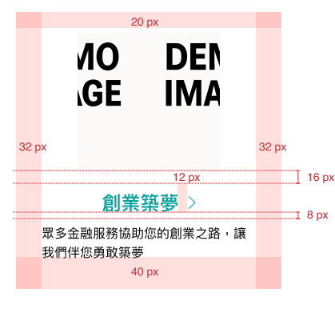
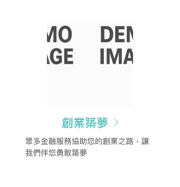
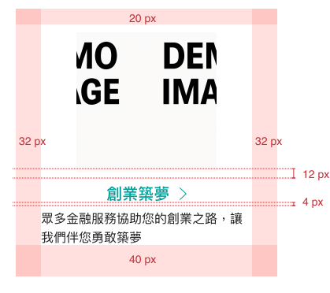
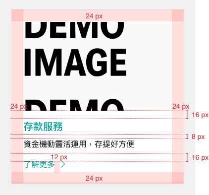
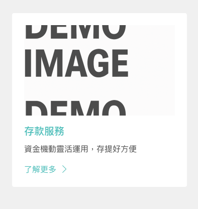
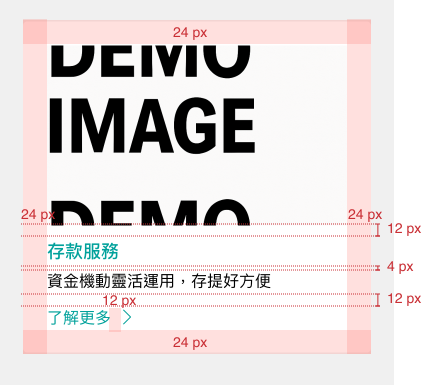
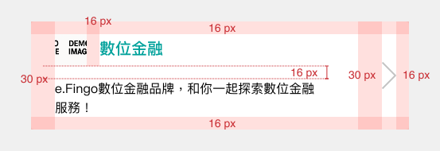
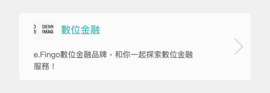
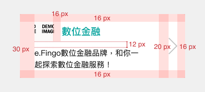

# Card 卡片
> 卡片是由「不同但相關」的資訊在同一個版面上，資訊都只是簡短的摘要，如果要取得更多深入的內容必須透過點擊卡片跳轉到詳細資訊頁面。

<script setup>
  import Card from '../components/Card.vue'
</script>

## 元件預覽
<Card />

## 程式碼
::: code-group

```html [html]
<!-- Card_Type1 -->
<a href="#" target="_blank" class="l-card type1">
  <div class="demoImg"></div>
  <p class="l-card--title">創業築夢<svg width="9" height="16" viewBox="0 0 9 16" fill="none"xmlns="http://www.w3.org/2000/svg"><g clip-path="url(#clip0_2102_1315)"><path d="M0.691101 15.3504L8.51124 8L0.691101 0.649588" stroke="#009E96" stroke-linecap="round"stroke-linejoin="round" /></g><defs><clipPath id="clip0_2102_1315"><rect width="9" height="16" fill="white" /></clipPath></defs></svg>
  </p>
  <p class="l-card--content">眾多金融服務協助您的創業之路，讓我們伴您勇敢築夢</p>
</a>

<!-- Card_Type2 -->
<!-- CardType2-Basic -->
<a href="#" target="_blank" class="l-card type2 basic">
    <div class="demoImg"></div>
    <p class="l-card--title">存款服務</p>
    <p class="l-card--content">資金機動靈活運用，存提好方便</p>
    <p class="l-card--cta">了解更多<svg width="8" height="15" viewBox="0 0 8 15" fill="none"xmlns="http://www.w3.org/2000/svg"><g clip-path="url(#clip0_2102_1730)"><path d="M0.614258 14.3911L7.56549 7.50004L0.614258 0.609037" stroke="#009E96"stroke-linecap="round"stroke-linejoin="round" /></g><defs><clipPath id="clip0_2102_1730"><rect width="8" height="15" fill="white" /></clipPath></defs></svg>
    </p>
</a>
<!-- CardType2-Line -->
<a href="#" target="_blank" class="l-card type2 line">
    <div class="demoImg"></div>
    <p class="l-card--title">存款服務</p>
    <p class="l-card--content">資金機動靈活運用，存提好方便</p>
    <p class="l-card--cta">了解更多<svg width="8" height="15" viewBox="0 0 8 15" fill="none"xmlns="http://www.w3.org/2000/svg"><g clip-path="url(#clip0_2102_1730)"><path d="M0.614258 14.3911L7.56549 7.50004L0.614258 0.609037" stroke="#009E96"stroke-linecap="round"stroke-linejoin="round" /></g><defs><clipPath id="clip0_2102_1730"><rect width="8" height="15" fill="white" /></clipPath></defs></svg>
    </p>
</a>

<!-- Card_Type3 -->
<a href="#" target="_blank" class="l-card type3">
    <div>
        <div class="l-card--top">
          <div class="demoImg"></div>
          <p class="l-card--title">數位金融</p>
        </div>
        <p class="l-card--content">e.Fingo數位金融品牌，和你一起探索數位金融服務！</p>
    </div>
    <svg width="18" height="34" viewBox="0 0 18 34" fill="none" xmlns="http://www.w3.org/2000/svg"><g clip-path="url(#clip0_2198_518)"><path d="M0.575439 0.581238L16.8496 17.0008L0.575439 33.4204" stroke="#C3C3C3" stroke-width="2" /></g><defs><clipPath id="clip0_2198_518"><rect width="18" height="34" fill="white" /></clipPath></defs></svg>
</a>
```

```css [css]
/* Card_Type1 */
.l-card.type1 {
    background: #FFFFFF;
    box-shadow: 0px 1px 2px rgba(0, 0, 0, 0.24), 0px 5px 20px rgba(64, 157, 153, 0.2);
    border-radius: 4px;
    padding: 20px 32px;
    padding-bottom: 40px;
    display: inline-block;
    max-width: 330px;
}

.l-card.type1:hover {
  opacity: 0.7;
}

.l-card.type1 .demoImg {
  width: 178px;
  height: 178px;
  background-color: #d5d5d5;
  display: block;
  margin: 0 auto;
}

.l-card.type1 .l-card--title {
  margin-top: 12px;
  margin-bottom: 0px;
  font-size: 20px;
  text-align: center;
  font-weight: bold;
}

.l-card.type1 .l-card--title svg {
  display: inline-block;
  vertical-align: middle;
  margin-top: -3px;
  margin-left: 12px;
}

.l-card.type1 .l-card--content {
  margin-top: 4px;
  margin-bottom: 0px;
  color: #1c1c1c;
  line-height: 1.5
}

@media (min-width: 992px) {
  .l-card.type1 .l-card--title {
  font-size: 24px;
  margin-top: 16px;
  }

  .l-card.type1 .l-card--content {
  margin-top: 8px;
  }
}
/* Card_Type2 */
.l-card.type2 {
  background: #FFFFFF;
  border-radius: 4px;
  padding: 24px;
  display: inline-block;
  max-width: 330px;
}

.l-card.type2:hover {
  opacity: 0.7;
}

.l-card.type2.line {
  border: solid 1px #D9D9D9
}

.l-card.type2.line:hover .l-card--title {
  opacity: 0.7;
}

.l-card.type2.line:hover {
  border: solid 1px #00a19b;
  opacity: 1;
}

.l-card.type2 .demoImg {
  width: 300px;
  height: 180px;
  max-width: 100%;
  background-color: #d5d5d5;
  display: block;
  margin: 0 auto;
}

.l-card.type2 .l-card--title {
  margin-top: 12px;
  margin-bottom: 0px;
  font-size: 20px;
  font-weight: bold;
}

.l-card.type2 .l-card--content {
  margin-top: 4px;
  margin-bottom: 0px;
  color: #1c1c1c;
  line-height: 1.5
}

.l-card.type2 .l-card--cta {
  margin-top: 12px;
  margin-bottom: 0px;
}

.l-card.type2 .l-card--cta svg {
  margin-left: 12px;
  display: inline-block;
  vertical-align: middle;
  margin-top: -3px;
}

@media (min-width: 992px) {
  .l-card.type2 .l-card--title {
  font-size: 24px;
  margin-top: 16px;
  }

  .l-card.type2 .l-card--content {
  margin-top: 8px;
  }

  .l-card.type2 .l-card--cta {
  margin-top: 16px;
  }
}
/* Card_Type3 */
.l-card.type3 {
  background: #FFFFFF;
  border-radius: 4px;
  padding: 16px;
  padding-left: 30px;
  display: flex;
}

.l-card.type3:hover {
  opacity: 0.7;
}

.l-card.type3 .demoImg {
  width: 40px;
  height: 40px;
  background-color: #d5d5d5;
  display: inline-block;
  margin-right: 16px;
}

.l-card.type3 .l-card--top {
  display: flex;
  align-items: center;
  margin-bottom: 12px;
}

.l-card.type3 .l-card--title {
  font-size: 20px;
}

.l-card.type3 svg {
  width: 18px;
  height: auto;
  margin-left: 20px;
}

.l-card.type3 .l-card--content {
  color: #1c1c1c;
  margin: 0px;
  line-height: 1.5
}

@media (min-width: 992px) {
  .l-card.type3 .l-card--top {
  margin-bottom: 16px;
  }

  .l-card.type3 .l-card--title {
  font-size: 24px;
  }

  .l-card.type3 svg {
  width: 18px;
  height: auto;
  margin-left: 20px;
  }
}
```
:::

## 元件規範

<b>Card_Type1</b>
<div class="table-responsive">
    <table class="table table-bordered w1000">
        <thead class="bg-primary-8">
            <tr>
                <th scope="col"></th>
                <th scope="col" colspan="3">(> 992px)</th>
            </tr>
        </thead>
        <tbody>
            <tr>
                <td rowspan="2" class="bg-primary-2" scope="row">
                    <p class="text-gray-11">:defualt</p>
                </td>
                <td>
                    
                </td>
            </tr>
            <tr>
                <td colspan="3">
                    <b>整張卡片設定帶連結</b><br>
                    <b>卡片：</b>
                    <ul class="pl-3 my-1">
                        <li>box-shadow: 0 5px 20px rgba(64, 157, 153, 0.2), 0 1px 2px rgba(0, 0, 0, 0.24)</li>
                        <li>border-radius:4px</li>
                        <li>圖片：178x178px</li>
                        <li>標題：font-size:24px/font-weight:bold /箭頭：9x16px</li>
                        <li>內容：font-size:16px/line-height:1.5</li>
                    </ul>
                </td>
            </tr>
            <tr>
                <td rowspan="2" class="bg-primary-2" scope="row">
                    <p class="text-gray-11">:hover</p>
                </td>
                <td>
                    
                </td>
            </tr>
            <tr>
                <td colspan="3">
                    <ul class="pl-3 my-1">
                        <b>卡片內容：</b>
                        <li>opacity:0.7</li>
                    </ul>
                </td>
            </tr>
        </tbody>
    </table>
    <table class="table table-bordered w1000">
        <thead class="bg-primary-8">
            <tr>
                <th scope="col"></th>
                <th scope="col" colspan="3">(≤ 991px)</th>
            </tr>
        </thead>
        <tbody>
            <tr>
                <td rowspan="2" class="bg-primary-2" scope="row">
                    <p class="text-gray-11">:defualt</p>
                </td>
                <td>
                    
                </td>
            </tr>
            <tr>
                <td colspan="3">
                    <b>卡片：</b>
                    <ul class="pl-3 my-1">
                        <li>box-shadow: 0 5px 20px rgba(64, 157, 153, 0.2), 0 1px 2px rgba(0, 0, 0, 0.24)</li>
                        <li>border-radius:4px</li>
                        <li>圖片：178x178px</li>
                        <li>標題：font-size:20px/font-weight:bold /箭頭：9x16px</li>
                        <li>內容：font-size:16px/line-height:1.5</li>
                    </ul>
                    <b>個別樣式同上</b>
                </td>
            </tr>
        </tbody>
    </table>
</div>
<b>Card_Type2</b>
<div class="table-responsive">
    <table class="table table-bordered w1000">
        <thead class="bg-primary-8">
            <tr>
                <th scope="col"></th>
                <th scope="col" colspan="2">(> 992px)</th>
            </tr>
        </thead>
        <tbody>
            <tr>
                <td rowspan="2" class="bg-primary-2" scope="row">
                    <p class="text-gray-11">:defualt</p>
                </td>
                <td>
                    
                </td>
                <td>
                    
                </td>
            </tr>
            <tr>
                <td>
                    <b>整張卡片設定帶連結</b><br>
                    <b>卡片：</b>
                    <ul class="pl-3 my-1">
                        <li>border-radius:4px</li>
                        <li>圖片：300x180px</li>
                        <li>標題：font-size:24px/font-weight:bold</li>
                        <li>內容&CTA：font-size:16px/line-height:1.5/箭頭：8x15px</li>
                    </ul>
                </td>
                <td>
                    <b>整張卡片設定帶連結</b><br>
                    <b>卡片：</b>
                    <ul class="pl-3 my-1">
                        <li>border:solid 1px #D9D9D9</li>
                        <li>其他設定同 basic</li>
                    </ul>
                </td>
            </tr>
            <tr>
                <td rowspan="2" class="bg-primary-2" scope="row">
                    <p class="text-gray-11">:hover</p>
                </td>
                <td>
                    
                </td>
                <td>
                    
                </td>
            </tr>
            <tr>
                <td>
                    <ul class="pl-3 my-1">
                        <b>卡片內容：</b>
                        <li>opacity:0.7</li>
                    </ul>
                </td>
                <td>
                    <ul class="pl-3 my-1">
                        <b>卡片內容：</b>
                        <li>border:solid 1px #00A19B</li>
                        <li>標題：opacity:0.7</li>
                    </ul>
                </td>
            </tr>
        </tbody>
    </table>
    <table class="table table-bordered w1000">
        <thead class="bg-primary-8">
            <tr>
                <th scope="col"></th>
                <th scope="col" colspan="2">(≤ 991px)</th>
            </tr>
        </thead>
        <tbody>
            <tr>
                <td rowspan="2" class="bg-primary-2" scope="row">
                    <p class="text-gray-11">:defualt</p>
                </td>
                <td>
                    
                </td>
                <td>
                    
                </td>
            </tr>
            <tr>
                <td>
                    <b>卡片：</b>
                    <ul class="pl-3 my-1">
                        <li>border-radius:4px</li>
                        <li>圖片：300x180px</li>
                        <li>標題：font-size:20px/font-weight:bold </li>
                        <li>內容：font-size:16px/line-height:1.5/箭頭：8x15px</li>
                    </ul>
                </td>
                <td>
                    <b>卡片：</b>
                    <ul class="pl-3 my-1">
                        <li>border:solid 1px #D9D9D9</li>
                        <li>其他設定同 basic</li>
                    </ul>
                </td>
            </tr>
        </tbody>
    </table>
</div>
<b>Card_Type3</b>
<div class="table-responsive">
    <table class="table table-bordered w1000">
        <thead class="bg-primary-8">
            <tr>
                <th scope="col"></th>
                <th scope="col" colspan="2">(> 992px)</th>
            </tr>
        </thead>
        <tbody>
            <tr>
                <td rowspan="2" class="bg-primary-2" scope="row">
                    <p class="text-gray-11">:defualt</p>
                </td>
                <td>
                    
                </td>
            </tr>
            <tr>
                <td>
                    <b>整張卡片設定帶連結</b><br>
                    <b>卡片：</b>
                    <ul class="pl-3 my-1">
                        <li>border-radius:4px</li>
                        <li>圖片：40x40px</li>
                        <li>標題：font-size:24px/font-weight:bold</li>
                        <li>內容：font-size:16px/line-height:1.5</li>
                        <li>箭頭：18x34px</li>
                    </ul>
                </td>
            </tr>
            <tr>
                <td rowspan="2" class="bg-primary-2" scope="row">
                    <p class="text-gray-11">:hover</p>
                </td>
                <td>
                    
                </td>
            </tr>
            <tr>
                <td>
                    <ul class="pl-3 my-1">
                        <b>卡片內容：</b>
                        <li>opacity:0.7</li>
                    </ul>
                </td>
            </tr>
        </tbody>
    </table>
    <table class="table table-bordered w1000">
        <thead class="bg-primary-8">
            <tr>
                <th scope="col"></th>
                <th scope="col" colspan="2">(≤ 991px)</th>
            </tr>
        </thead>
        <tbody>
            <tr>
                <td rowspan="2" class="bg-primary-2" scope="row">
                    <p class="text-gray-11">:defualt</p>
                </td>
                <td>
                    
                </td>
            </tr>
            <tr>
                <td>
                    <b>卡片：</b>
                    <ul class="pl-3 my-1">
                        <li>border-radius:4px</li>
                        <li>圖片：40x40px</li>
                        <li>標題：font-size:20px/font-weight:bold </li>
                        <li>內容：font-size:16px/line-height:1.5</li>
                        <li>箭頭：18x34px</li>
                    </ul>
                </td>
            </tr>
        </tbody>
    </table>
</div>