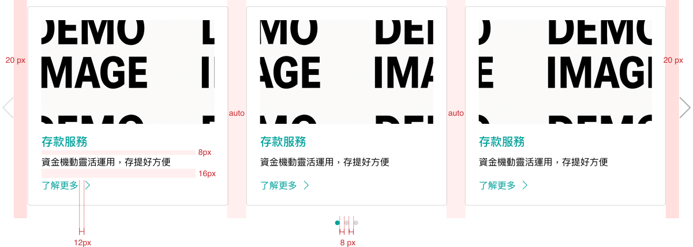
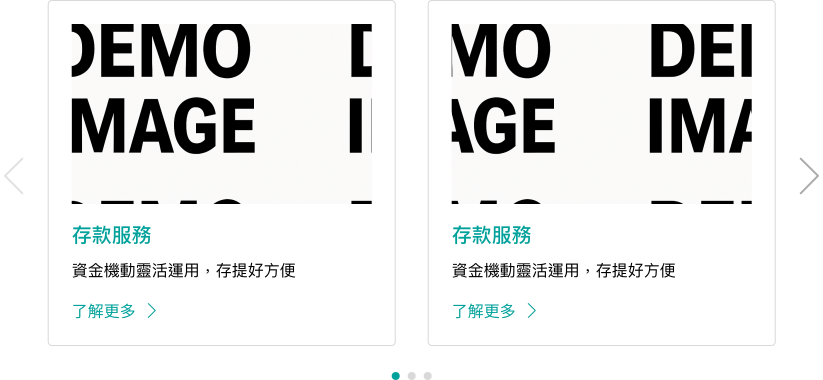
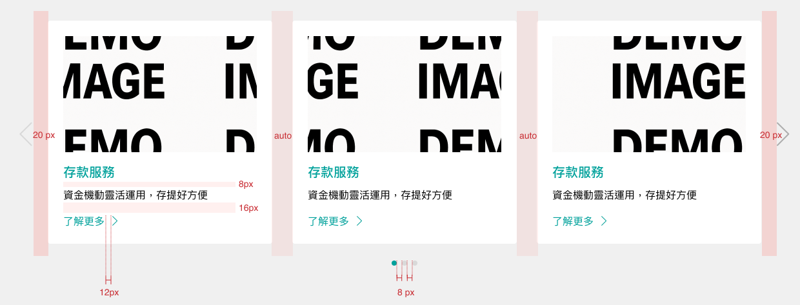
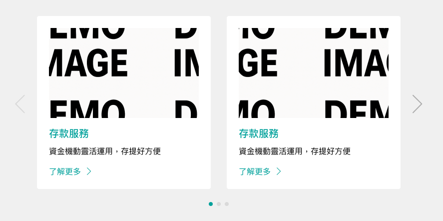
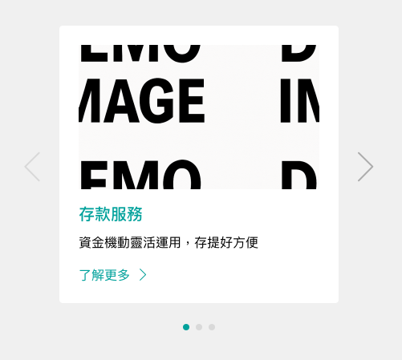

# Carousel 輪播 <a style="display: inline-block;vertical-align: middle;margin: 0;margin-top: -8px;margin-right: 0;" href="https://www.figma.com/design/Fppf6fNXYu9MdCsQCY3ox0/%E5%85%83%E4%BB%B6%E6%AF%94%E8%BC%83%E8%A1%A8?node-id=36-4" target="_blank"></a>
> 輪播元件為卡片設計的延伸，專為優化有限空間內的資訊密度而設計。支援左右滑動與自動輪播功能，能引導使用者有節奏地瀏覽多項重點內容。

<script setup>
    import Carousel from '../components/Carousel.vue'
</script>

## 元件預覽
<Carousel />

## 程式碼
::: code-group

```html [html]
<!-- Carousel_Type1 -->
<div class="carousel-type1">
    <div class="swiper">
        <div class="swiper-wrapper">
            <a href="#" target="_blank" class="swiper-slide l-card type2 line">
                <div class="demoImg"></div>
                <p class="l-card--title">存款服務</p>
                <p class="l-card--content">資金機動靈活運用，存提好方便</p>
                <p class="l-card--cta">了解更多<svg width="9" height="16" viewBox="0 0 9 16" fill="none"xmlns="http://www.w3.org/2000/svg"><g clip-path="url(#clip0_2102_1315)"><path d="M0.691101 15.3504L8.51124 8L0.691101 0.649588" stroke="#009E96" stroke-linecap="round"stroke-linejoin="round" /></g><defs><clipPath id="clip0_2102_1315"><rect width="9" height="16" fill="white" /></clipPath></defs></svg>
                </p>
            </a>
            <a href="#" target="_blank" class="swiper-slide l-card type2 line">
                <div class="demoImg"></div>
                <p class="l-card--title">存款服務</p>
                <p class="l-card--content">資金機動靈活運用，存提好方便</p>
                <p class="l-card--cta">了解更多<svg width="9" height="16" viewBox="0 0 9 16" fill="none"xmlns="http://www.w3.org/2000/svg"><g clip-path="url(#clip0_2102_1315)"><path d="M0.691101 15.3504L8.51124 8L0.691101 0.649588" stroke="#009E96" stroke-linecap="round"stroke-linejoin="round" /></g><defs><clipPath id="clip0_2102_1315"><rect width="9" height="16" fill="white" /></clipPath></defs></svg>
                </p>
            </a>
            <a href="#" target="_blank" class="swiper-slide l-card type2 line">
                <div class="demoImg"></div>
                <p class="l-card--title">存款服務</p>
                <p class="l-card--content">資金機動靈活運用，存提好方便</p>
                <p class="l-card--cta">了解更多<svg width="9" height="16" viewBox="0 0 9 16" fill="none"xmlns="http://www.w3.org/2000/svg"><g clip-path="url(#clip0_2102_1315)"><path d="M0.691101 15.3504L8.51124 8L0.691101 0.649588" stroke="#009E96" stroke-linecap="round"stroke-linejoin="round" /></g><defs><clipPath id="clip0_2102_1315"><rect width="9" height="16" fill="white" /></clipPath></defs></svg>
                </p>
            </a>
            <a href="#" target="_blank" class="swiper-slide l-card type2 line">
                <div class="demoImg"></div>
                <p class="l-card--title">存款服務</p>
                <p class="l-card--content">資金機動靈活運用，存提好方便</p>
                <p class="l-card--cta">了解更多<svg width="9" height="16" viewBox="0 0 9 16" fill="none"xmlns="http://www.w3.org/2000/svg"><g clip-path="url(#clip0_2102_1315)"><path d="M0.691101 15.3504L8.51124 8L0.691101 0.649588" stroke="#009E96" stroke-linecap="round"stroke-linejoin="round" /></g><defs><clipPath id="clip0_2102_1315"><rect width="9" height="16" fill="white" /></clipPath></defs></svg>
                </p>
            </a>
        </div>
    </div>
    <div class="swiper-pagination swiper-pagination1"></div>
    <div class="swiper-button-prev swiper-button-prev1"></div>
    <div class="swiper-button-next swiper-button-next1"></div>
</div>
<!-- Carousel_Type2 -->
<div style="background-color: #f0f0f0;padding: 50px;">
    <div class="carousel-type2">
        <div class="swiper">
            <div class="swiper-wrapper">
                <a href="#" target="_blank" class="swiper-slide l-card type2 basic">
                    <div class="demoImg"></div>
                    <p class="l-card--title">存款服務</p>
                    <p class="l-card--content">資金機動靈活運用，存提好方便</p>
                    <p class="l-card--cta">了解更多<svg width="9" height="16" viewBox="0 0 9 16" fill="none"xmlns="http://www.w3.org/2000/svg"><g clip-path="url(#clip0_2102_1315)"><path d="M0.691101 15.3504L8.51124 8L0.691101 0.649588" stroke="#009E96" stroke-linecap="round"stroke-linejoin="round" /></g><defs><clipPath id="clip0_2102_1315"><rect width="9" height="16" fill="white" /></clipPath></defs></svg>
                    </p>
                </a>
                <a href="#" target="_blank" class="swiper-slide l-card type2 basic">
                    <div class="demoImg"></div>
                    <p class="l-card--title">存款服務</p>
                    <p class="l-card--content">資金機動靈活運用，存提好方便</p>
                    <p class="l-card--cta">了解更多<svg width="9" height="16" viewBox="0 0 9 16" fill="none"xmlns="http://www.w3.org/2000/svg"><g clip-path="url(#clip0_2102_1315)"><path d="M0.691101 15.3504L8.51124 8L0.691101 0.649588" stroke="#009E96" stroke-linecap="round"stroke-linejoin="round" /></g><defs><clipPath id="clip0_2102_1315"><rect width="9" height="16" fill="white" /></clipPath></defs></svg>
                    </p>
                </a>
                <a href="#" target="_blank" class="swiper-slide l-card type2 basic">
                    <div class="demoImg"></div>
                    <p class="l-card--title">存款服務</p>
                    <p class="l-card--content">資金機動靈活運用，存提好方便</p>
                    <p class="l-card--cta">了解更多<svg width="9" height="16" viewBox="0 0 9 16" fill="none"xmlns="http://www.w3.org/2000/svg"><g clip-path="url(#clip0_2102_1315)"><path d="M0.691101 15.3504L8.51124 8L0.691101 0.649588" stroke="#009E96" stroke-linecap="round"stroke-linejoin="round" /></g><defs><clipPath id="clip0_2102_1315"><rect width="9" height="16" fill="white" /></clipPath></defs></svg>
                    </p>
                </a>
                <a href="#" target="_blank" class="swiper-slide l-card type2 basic">
                    <div class="demoImg"></div>
                    <p class="l-card--title">存款服務</p>
                    <p class="l-card--content">資金機動靈活運用，存提好方便</p>
                    <p class="l-card--cta">了解更多<svg width="9" height="16" viewBox="0 0 9 16" fill="none"xmlns="http://www.w3.org/2000/svg"><g clip-path="url(#clip0_2102_1315)"><path d="M0.691101 15.3504L8.51124 8L0.691101 0.649588" stroke="#009E96" stroke-linecap="round"stroke-linejoin="round" /></g><defs><clipPath id="clip0_2102_1315"><rect width="9" height="16" fill="white" /></clipPath></defs></svg>
                    </p>
                </a>
            </div>
        </div>
        <div class="swiper-pagination swiper-pagination2"></div>
        <div class="swiper-button-prev swiper-button-prev2"></div>
        <div class="swiper-button-next swiper-button-next2"></div>
    </div>
</div>
```
```css [css]
.carousel-type1,
.carousel-type2 {
    position: relative;
}

.swiper-button-prev,
.swiper-button-next {
  color: #acacac;
}

.swiper-button-prev {
  left: -52px;
}

.swiper-button-next {
  right: -52px
}

.swiper-pagination {
  bottom: -32px !important;
}

.swiper-pagination span {
  width: 8px !important;
  height: 8px !important;
}

.swiper-pagination .swiper-pagination-bullet-active {
  background: #00a19b;
  border: 1px solid #00a19b;
}

.l-card.type1 {
  background: #FFFFFF;
  box-shadow: 0px 1px 2px rgba(0, 0, 0, 0.24), 0px 5px 20px rgba(64, 157, 153, 0.2);
  border-radius: 4px;
  padding: 20px 32px;
  padding-bottom: 40px;
  display: inline-block;
  max-width: 330px;
}

.l-card.type1:hover {
  opacity: 0.7;
}

.l-card.type1 .demoImg {
  width: 178px;
  height: 178px;
  background-color: #d5d5d5;
  display: block;
  margin: 0 auto;
}

.l-card.type1 .l-card--title {
  margin-top: 12px;
  margin-bottom: 0px;
  font-size: 18px;
  text-align: center;
  font-weight: bold;
}

.l-card.type1 .l-card--title svg {
  display: inline-block;
  vertical-align: middle;
  margin-top: -3px;
  margin-left: 12px;
}

.l-card.type1 .l-card--content {
  margin-top: 4px;
  margin-bottom: 0px;
  color: #1c1c1c;
  line-height: 1.5
}

@media (min-width: 992px) {
  .l-card.type1 .l-card--title {
  font-size: 20px;
  margin-top: 16px;
  }

  .l-card.type1 .l-card--content {
  margin-top: 8px;
  }
}

.l-card.type2 {
  background: #FFFFFF;
  border-radius: 4px;
  padding: 24px;
  display: inline-block;
  max-width: 330px;
}

.l-card.type2:hover {
  opacity: 0.7;
}

.l-card.type2.line {
  border: solid 1px #D9D9D9
}

.l-card.type2.line:hover .l-card--title {
  opacity: 0.7;
}

.l-card.type2.line:hover {
  border: solid 1px #00a19b;
  opacity: 1;
}

.l-card.type2 .demoImg {
  width: 300px;
  height: 180px;
  max-width: 100%;
  background-color: #d5d5d5;
  display: block;
  margin: 0 auto;
}

.l-card.type2 .l-card--title {
  margin-top: 12px;
  margin-bottom: 0px;
  font-size: 18px;
  font-weight: bold;
}

.l-card.type2 .l-card--content {
  margin-top: 4px;
  margin-bottom: 0px;
  color: #1c1c1c;
  line-height: 1.5
}

.l-card.type2 .l-card--cta {
  margin-top: 12px;
  margin-bottom: 0px;
}

.l-card.type2 .l-card--cta svg {
  margin-left: 12px;
  display: inline-block;
  vertical-align: middle;
  margin-top: -3px;
}

@media (min-width: 992px) {
  .l-card.type2 .l-card--title {
  font-size: 20px;
  margin-top: 16px;
  }

  .l-card.type2 .l-card--content {
  margin-top: 8px;
  }

  .l-card.type2 .l-card--cta {
  margin-top: 16px;
  }
}

.l-card.type3 {
  background: #FFFFFF;
  border-radius: 4px;
  padding: 16px;
  padding-left: 30px;
  display: flex;
}

.l-card.type3:hover {
  opacity: 0.7;
}

.l-card.type3 .demoImg {
  width: 40px;
  height: 40px;
  background-color: #d5d5d5;
  display: inline-block;
  margin-right: 16px;
}

.l-card.type3 .l-card--top {
  display: flex;
  align-items: center;
  margin-bottom: 12px;
}

.l-card.type3 .l-card--title {
  font-size: 18px;
}

.l-card.type3 svg {
  width: 18px;
  height: auto;
  margin-left: 20px;
}

.l-card.type3 .l-card--content {
  color: #1c1c1c;
  margin: 0px;
  line-height: 1.5
}

@media (min-width: 992px) {
  .l-card.type3 .l-card--top {
  margin-bottom: 16px;
  }

  .l-card.type3 .l-card--title {
  font-size: 20px;
  }

  .l-card.type3 svg {
  width: 18px;
  height: auto;
  margin-left: 20px;
  }
}
```
```js [js]
const swiper = new Swiper('.carousel-type1 .swiper', {
    spaceBetween: 20,
    navigation: {
      nextEl: ".swiper-button-next1",
      prevEl: ".swiper-button-prev1",
    },
    pagination: {
      el: '.swiper-pagination1',
      clickable: true,
    },
    slidesPerView: 1,
    // Responsive breakpoints
    breakpoints: {
      // when window width is >= 768px
      768: {
        slidesPerView: 2
      },
      // when window width is >= 1200px
      1200: {
        slidesPerView: 3
      }
    }
});
const swiper2 = new Swiper('.carousel-type2 .swiper', {
    spaceBetween: 20,
    navigation: {
      nextEl: ".swiper-button-next2",
      prevEl: ".swiper-button-prev2",
    },
    pagination: {
      el: '.swiper-pagination2',
      clickable: true,
    },
    slidesPerView: 1,
    // Responsive breakpoints
    breakpoints: {
      // when window width is >= 768px
      768: {
        slidesPerView: 2
      },
      // when window width is >= 1200px
      1200: {
        slidesPerView: 3
      }
    }
});

```

## 元件規範

<b>carousel-type1</b>
<div class="table-responsive">
    <table class="table table-bordered w1000">
        <thead class="bg-primary-8">
            <tr>
                <th scope="col"></th>
                <th scope="col" colspan="3">Extra large(≥ 1200px)</th>
            </tr>
        </thead>
        <tbody>
            <tr>
                <td rowspan="2" class="bg-primary-2" scope="row">
                    <p class="text-gray-11">:defualt</p>
                </td>
                <td>
                    
                </td>
            </tr>
            <tr>
                <td>
                    <ul class="pl-3 my-1">
                        <li>規範：<br><b>在大於1200尺寸時，卡片數量３個</b><br>預設畫面 向前箭頭狀態 Disabled</li>
                        <li>箭頭尺寸：<br>27x44px/color: $gray-6 #acacac<br>Disabled: opacity:0.35</li>
                        <li>邊框：<br>border: 1px solid $gray-5 #d9d9d9</li>
                        <li>文字：<br>標題 font-size: 20px/color: $primary-8 #00a19b/font-weight:700<br>內文 font-size: 16px/color: $gray-11 #1c1c1c</li>
                        <li>按鈕：<br>文字 font-size: 16px/color: $primary-8 #00a19b<br>箭頭 8x15px/color:$primary-8 #00a19b</li>
                        <li>輪播：<br>8x8px<br>Default: color:$gray-5 #d9d9d9<br>Active: color:$primary-8 #00a19b</li>
                    </ul>
                </td>
            </tr>
        </tbody>
    </table>
    <table class="table table-bordered w1000">
        <thead class="bg-primary-8">
            <tr>
                <th scope="col"></th>
                <th scope="col" colspan="3">Medium(≥ 768px)</th>
            </tr>
        </thead>
        <tbody>
            <tr>
                <td rowspan="2" class="bg-primary-2" scope="row">
                    <p class="text-gray-11">:defualt</p>
                </td>
                <td>
                    
                </td>
            </tr>
            <tr>
                <td colspan="3">
                    <ul class="pl-3 my-1">
                        <li>規範：<br>在大於等於768尺寸時 卡片數量2個</li>
                    </ul>
                </td>
            </tr>
        </tbody>
    </table>
    <table class="table table-bordered w1000">
        <thead class="bg-primary-8">
            <tr>
                <th scope="col"></th>
                <th scope="col" colspan="3">(< 768px)</th>
            </tr>
        </thead>
        <tbody>
            <tr>
                <td rowspan="2" class="bg-primary-2" scope="row">
                    <p class="text-gray-11">:defualt</p>
                </td>
                <td>
                    
                </td>
            </tr>
            <tr>
                <td colspan="3">
                    <ul class="pl-3 my-1">
                        <li>規範：<br>在小於768尺寸時 卡片數量1個</li>
                    </ul>
                </td>
            </tr>
        </tbody>
    </table>
</div>

<b>carousel-type2</b>
<div class="table-responsive">
    <table class="table table-bordered w1000">
        <thead class="bg-primary-8">
            <tr>
                <th scope="col"></th>
                <th scope="col" colspan="3">Extra large(≥ 1200px)</th>
            </tr>
        </thead>
        <tbody>
            <tr>
                <td rowspan="2" class="bg-primary-2" scope="row">
                    <p class="text-gray-11">:defualt</p>
                </td>
                <td>
                    
                </td>
            </tr>
            <tr>
                <td>
                    <ul class="pl-3 my-1">
                        <li>規範：<br><b>在大於1200尺寸時，卡片數量３個</b><br>預設畫面 向前箭頭狀態 Disabled</li>
                        <li>箭頭尺寸：<br>27x44px/color: $gray-6 #acacac<br>Disabled: opacity:0.35</li>
                        <li>卡片背景：<br>background-color: $gray-1 #ffffff</li>
                        <li>文字：<br>標題 font-size: 20px/color: $primary-8 #00a19b/font-weight:700<br>內文 font-size: 16px/color: $gray-11 #1c1c1c</li>
                        <li>按鈕：<br>文字 font-size: 16px/color: $primary-8 #00a19b<br>箭頭 8x15px/color:$primary-8 #00a19b</li>
                        <li>輪播：<br>8x8px<br>Default: color:$gray-5 #d9d9d9<br>Active: color:$primary-8 #00a19b</li>
                    </ul>
                </td>
            </tr>
        </tbody>
    </table>
    <table class="table table-bordered w1000">
        <thead class="bg-primary-8">
            <tr>
                <th scope="col"></th>
                <th scope="col" colspan="2">Medium(≥ 768px)</th>
            </tr>
        </thead>
        <tbody>
            <tr>
                <td rowspan="2" class="bg-primary-2" scope="row">
                    <p class="text-gray-11">:defualt</p>
                </td>
                <td>
                    
                </td>
            </tr>
            <tr>
                <td colspan="3">
                    <ul class="pl-3 my-1">
                        <li>規範：<br>在大於等於768尺寸時 卡片數量2個</li>
                    </ul>
                </td>
            </tr>
        </tbody>
    </table>
    <table class="table table-bordered w1000">
        <thead class="bg-primary-8">
            <tr>
                <th scope="col"></th>
                <th scope="col" colspan="2">(< 768px)</th>
            </tr>
        </thead>
        <tbody>
            <tr>
                <td rowspan="2" class="bg-primary-2" scope="row">
                    <p class="text-gray-11">:defualt</p>
                </td>
                <td>
                    
                </td>
            </tr>
            <tr>
                <td colspan="3">
                    <ul class="pl-3 my-1">
                        <li>規範：<br>在小於768尺寸時 卡片數量1個</li>
                    </ul>
                </td>
            </tr>
        </tbody>
    </table>
</div>