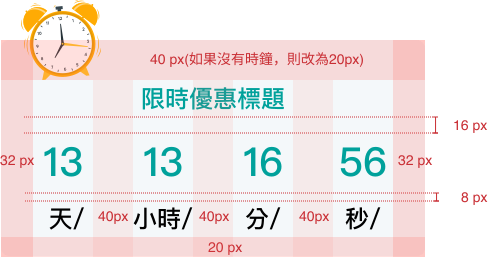

# Reciprocal 倒數計時器
> 提供清晰的視覺回饋，讓使用者感受時間流逝。

<script setup>
    import Reciprocal from '../components/Reciprocal.vue'
</script>

## 元件預覽
<Reciprocal />

## 程式碼
::: code-group

```html [html]
<div class="l-reciprocal">
    <div class="title-container">
        
        <div class="title">限時優惠標題</div>
    </div>
    <div class="timer-container">
        <div class="time-box">
            <div class="number" id="days">00</div>
            <div class="label">天/</div>
        </div>
        <div class="time-box">
            <div class="number" id="hours">00</div>
            <div class="label">小時/</div>
        </div>
        <div class="time-box">
            <div class="number" id="minutes">00</div>
            <div class="label">分/</div>
        </div>
        <div class="time-box">
            <div class="number" id="seconds">00</div>
            <div class="label">秒/</div>
        </div>
    </div>
</div>
```

```css [css]
.l-reciprocal {
    position: relative;
    display: inline-block;
    background-color: #F4F8FA;
    padding: 40px 32px;
    padding-bottom: 20px;
    border-radius: 8px;
    margin-top: 40px;
}

.l-reciprocal .title-container {
    display: flex;
    align-items: center;
    margin-bottom: 12px;
    justify-content: flex-start;
}

.l-reciprocal .clock-icon {
    width: 80px;
    height: 80px;
    left: 20px;
    top: -40px;
    position: absolute;
}

.l-reciprocal .title {
    color: #009a9a;
    font-size: 20px;
    font-weight: bold;
    text-align: center;
    margin: 0 auto;
}

.l-reciprocal .timer-container {
    display: flex;
    justify-content: space-between;
    gap: 32px;
}

.l-reciprocal .time-box {
    display: flex;
    flex-direction: column;
    align-items: center;
    width: 50px;
}

.l-reciprocal .number {
    color: #009a9a;
    font-size: 36px;
    font-weight: bold;
    line-height: 1.5;
}

.l-reciprocal .label {
    color: #1c1c1c;
    font-size: 20px;
    margin-top: 8px;
    font-weight: bold;
    line-height: 1.5;
}

@media (min-width: 992px) {
    .l-reciprocal .title-container {
        margin-bottom: 16px;
    }

    .l-reciprocal .title {
        font-size: 24px;
    }

    .l-reciprocal .timer-container {
        gap: 40px;
    }

    .l-reciprocal .time-box {
        width: 60px;
    }

    .l-reciprocal .number {
        font-size: 40px;
    }

    .l-reciprocal .label {
        font-size: 24px;
    }
}
```
```js [js]
$(document).ready(function () {
    // 設定目標時間
    const targetDate = new Date();
    targetDate.setDate(targetDate.getDate() + 0);
    targetDate.setHours(targetDate.getHours() + 0);
    targetDate.setMinutes(targetDate.getMinutes() + 0);
    targetDate.setSeconds(targetDate.getSeconds() + 59);

    const endTime = targetDate.getTime();

    function updateCountdown() {
      const now = new Date().getTime();
      const distance = endTime - now;

      if (distance >= 0) {
        // 計算時分秒
        const d = Math.floor(distance / (1000 * 60 * 60 * 24));
        const h = Math.floor((distance % (1000 * 60 * 60 * 24)) / (1000 * 60 * 60));
        const m = Math.floor((distance % (1000 * 60 * 60)) / (1000 * 60));
        const s = Math.floor((distance % (1000 * 60)) / 1000);

        // 使用 jQuery 的 .text() 更新內容
        $('#days').text(d);
        $('#hours').text(h);
        $('#minutes').text(m);
        $('#seconds').text(s);
      } else {
        // 倒數結束後的處理
        clearInterval(timerInterval);
        $('.title').text('優惠已結束');
        $('.number').text('00');
      }
    }

    // 啟動計時器
    const timerInterval = setInterval(updateCountdown, 1000);

    // 立即執行一次，避免畫面閃爍預設值
    updateCountdown();
});
```
:::

## 元件規範
<div class="table-responsive">
    <table class="table table-bordered w1000">
        <thead class="bg-primary-8">
            <tr>
                <th scope="col"></th>
                <th scope="col" colspan="3">(> 992px)</th>
            </tr>
        </thead>
        <tbody>
            <tr>
                <td rowspan="2" class="bg-primary-2" scope="row">
                    <p class="text-gray-11">:defualt</p>
                </td>
                <td>
                    
                </td>
                <td>
                    
                </td>
            </tr>
            <tr>
                <td>
                    <b>標題：</b>
                    <ul class="pl-3 my-1">
                        <li>font-size:24px/font-weight:bold</li>
                    </ul>
                    <b>日期：</b>
                    <ul class="pl-3 my-1">
                        <li>數字 font-size:40px/font-weight:bold/line-height:1.5</li>
                        <li>時刻 font-size:24px/font-weight:bold/line-height:1.5</li>
                    </ul>
                    <b style="color:#C92E34">顏色：可依行銷頁規範搭配</b>
                </td>
                <td>
                    <b>尺寸：</b>
                    <ul class="pl-3 my-1">
                        <li>80x80px</li>
                    </ul>
                </td>
            </tr>
        </tbody>
    </table>
    <table class="table table-bordered w1000">
        <thead class="bg-primary-8">
            <tr>
                <th scope="col"></th>
                <th scope="col" colspan="3">(≤ 991px)</th>
            </tr>
        </thead>
        <tbody>
            <tr>
                <td rowspan="2" class="bg-primary-2" scope="row">
                    <p class="text-gray-11">:defualt</p>
                </td>
                <td>
                    
                </td>
                <td>
                    
                </td>
            </tr>
            <tr>
                <td>
                    <b>標題：</b>
                    <ul class="pl-3 my-1">
                        <li>font-size:20px/font-weight:bold</li>
                    </ul>
                    <b>日期：</b>
                    <ul class="pl-3 my-1">
                        <li>數字 font-size:36px/font-weight:bold/line-height:1.5</li>
                        <li>時刻 font-size:20px/font-weight:bold/line-height:1.5</li>
                    </ul>
                </td>
                <td>
                    <b>尺寸：</b>
                    <ul class="pl-3 my-1">
                        <li>80x80px</li>
                    </ul>
                </td>
            </tr>
        </tbody>
    </table>
</div>