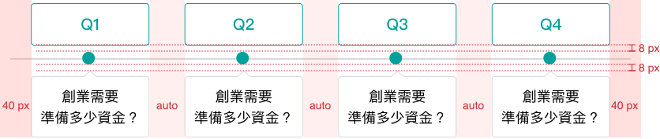
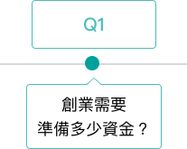
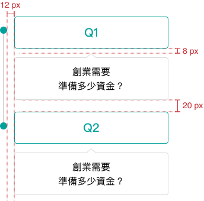

# Timeline 時間軸 <a style="display: inline-block;vertical-align: middle;margin: 0;margin-top: -8px;margin-right: 0;" href="https://www.figma.com/design/Fppf6fNXYu9MdCsQCY3ox0/%E5%85%83%E4%BB%B6%E6%AF%94%E8%BC%83%E8%A1%A8?node-id=36-9" target="_blank"></a>
> 將任務流程或個人活動依照先後順序視覺化呈現。

<script setup>
    import Timeline from '../components/Timeline.vue'
</script>

## 元件預覽
<Timeline />

## 程式碼
::: code-group

```html [html]
<div class="l-timeLine">
    <div class="l-timeLine__wrap">
        <div class="l-timeLine__line"></div>
        <ul class="l-timeLine__contentWrap">
            <li>
                <a href="javascript:;">
                    <div class="l-timeLine__boxTop">Q1</div>
                    <div class="l-timeLine__boxBottom">
                        <div class="l-timeLine__content">
                            <p>創業需要準備多少資金？</p>
                        </div>
                    </div>
                </a>
            </li>
            <li>
                <a href="javascript:;">
                    <div class="l-timeLine__boxTop">Q2</div>
                    <div class="l-timeLine__boxBottom">
                        <div class="l-timeLine__content">
                            <p>創業需要準備多少資金？</p>
                        </div>
                    </div>
                </a>
            </li>
            <li>
                <a href="javascript:;">
                    <div class="l-timeLine__boxTop">Q3</div>
                    <div class="l-timeLine__boxBottom">
                        <div class="l-timeLine__content">
                            <p>創業需要準備多少資金？</p>
                        </div>
                    </div>
                </a>
            </li>
            <li>
                <a href="javascript:;">
                    <div class="l-timeLine__boxTop">Q4</div>
                    <div class="l-timeLine__boxBottom">
                        <div class="l-timeLine__content">
                            <p>創業需要準備多少資金？</p>
                        </div>
                    </div>
                </a>
            </li>
        </ul>
    </div>
</div>
```

```css [css]
.l-timeLine {
  text-align: center
}

.l-timeLine__wrap {
  position: relative;
  text-align: left;
  display: -webkit-box;
  display: -ms-flexbox;
  display: flex;
  padding: 0px;
}

.l-timeLine__line {
  position: absolute;
  height: calc(100% - 160px);
  width: 2px;
  left: 6px;
  top: 36px;
  background: #d9d9d9;
}

.l-timeLine__contentWrap {
  width: 100%;
  margin-left: 24px;
  display: -webkit-box;
  display: -ms-flexbox;
  display: flex;
  -webkit-box-orient: vertical;
  -webkit-box-direction: normal;
  -ms-flex-direction: column;
  flex-direction: column;
  padding: 0px;
}

.l-timeLine__contentWrap li {
  margin-top: 0px;
  margin-bottom: 20px;
  padding: 0px;
}

.l-timeLine__contentWrap li a {
  outline: none
}

.l-timeLine__contentWrap li:hover .l-timeLine__boxTop {
  border: solid 1px #3cbaad;
  color: #3cbaad;
  -webkit-transition: all 0.3s cubic-bezier(0.25, 0.8, 0.25, 1);
  transition: all 0.3s cubic-bezier(0.25, 0.8, 0.25, 1)
}

.l-timeLine__contentWrap li:hover .l-timeLine__boxBottom {
  border: solid 1px #3cbaad;
  -webkit-transition: all 0.3s cubic-bezier(0.25, 0.8, 0.25, 1);
  transition: all 0.3s cubic-bezier(0.25, 0.8, 0.25, 1)
}

.l-timeLine__contentWrap li:hover .l-timeLine__boxBottom:before {
  border-right: 1px solid #3cbaad;
  border-bottom: 1px solid #3cbaad;
  -webkit-transition: all 0.3s cubic-bezier(0.25, 0.8, 0.25, 1);
  transition: all 0.3s cubic-bezier(0.25, 0.8, 0.25, 1)
}

.l-timeLine__content {
  padding: 12px;
  color: #1c1c1c;
  font-weight: normal;
}

.l-timeLine__content p {
  margin: 0px;
  line-height: 1.5;
  font-size: 16px;
}

.l-timeLine__boxTop {
  text-align: center;
  border: solid 1px #00a19b;
  border-radius: 4px;
  padding: 12px;
  position: relative;
  font-size: 18px;
}

.l-timeLine__boxTop:before {
  content: "";
  position: absolute;
  width: 12px;
  height: 12px;
  background: #00a19b;
  border-radius: 6px;
  left: -24px;
  top: 50%;
  -webkit-transform: translateY(-50%);
  transform: translateY(-50%)
}

.l-timeLine__boxBottom {
  position: relative;
  border: solid 1px #d9d9d9;
  border-radius: 4px;
  margin-top: 16px;
  
}

.l-timeLine__boxBottom:before {
  content: "";
  position: absolute;
  margin: auto;
  top: -8px;
  left: 0;
  right: 0;
  width: 15px;
  height: 15px;
  -webkit-transform: rotate(225deg);
  transform: rotate(225deg);
  background: #ffffff;
  border: 0px dashed #000;
  border-right: 1px solid #d9d9d9;
  border-bottom: 1px solid #d9d9d9;
  border-radius: 2px
}

@media (min-width:768px) {
  .l-timeLine__wrap {
  padding: 0px 40px;
  }
  .l-timeLine__line {
  width: calc(100%);
  height: 2px;
  top: 66px;
  left: 0;

  }

  .l-timeLine__contentWrap {
  -webkit-box-orient: horizontal;
  -webkit-box-direction: normal;
  -ms-flex-direction: row;
  flex-direction: row;
  -webkit-box-pack: space-evenly;
  -ms-flex-pack: space-evenly;
  justify-content: space-evenly;
  margin: auto;
  }
  .l-timeLine__contentWrap li{
  padding: 0px 8px;
  }
  .l-timeLine__boxBottom {
  margin-top: 40px
  }
  .l-timeLine__boxTop{
  padding: 12px;
  font-size: 20px;
  }

  .l-timeLine__boxTop:before {
  top: 58px;
  left: 50%;
  -webkit-transform: translateX(-50%);
  transform: translateX(-50%);
  width: 16px;
  height: 16px;
  border-radius: 8px;
  }

  .l-timeLine__content p {
  font-size: 18px;
  }
}
```
:::

## 元件規範
<div class="table-responsive">
    <table class="table table-bordered w1000">
        <thead class="bg-primary-8">
            <tr>
                <th scope="col"></th>
                <th scope="col" colspan="3">Medium(≥768px)</th>
            </tr>
        </thead>
        <tbody>
            <tr>
                <td rowspan="2" class="bg-primary-2" scope="row">
                    <p class="text-gray-11">:defualt</p>
                </td>
                <td>
                    
                </td>
            </tr>
            <tr>
                <td>
                    <b>標題/內容區域</b>
                    <ul class="pl-3 my-1">
                        <li>標題與內容寬度等寬</li>
                        <li>文字：<br>標題 font-size:20px/font-weight:bold/color:$Primary-8 #00a19b<br>
內文 font-size:18px/font-weight:regular/color:$Gray-11 #1C1C1C</li>
                        <li>其他：<br>圓角border-radius:4px<br>內距padding:12px<br>邊框：標題border:solid 1px $Primary-8 #00a19b/內文border:solid 1px $Gray-5 #d9d9d9
                        </li>
                    </ul>
                    <b>時間軸</b>
                    <ul class="pl-3 my-1">
                        <li>其他：<br>節點大小16x16px<br>節點顏色background-color:$Primary-8 #00a19b<br>節點圓角border-radius:8px<br>軸線border:solid 2px $Gray-5 #d9d9d9</li>
                    </ul>
                </td>
            </tr>
            <tr>
                <td rowspan="2" class="bg-primary-2" scope="row">
                    <p class="text-gray-11">:hover</p>
                </td>
                <td>
                    
                </td>
            </tr>
            <tr>
                <td>
                    <b>標題區域</b>
                    <ul class="pl-3 my-1">
                        <li>透明度 opacity:0.7</li>
                    </ul>
                    <b>內容區域</b>
                    <ul class="pl-3 my-1">
                        <li>邊框 border:solid 1px rgba(0, 161, 155, 0.7)</li>
                    </ul>
                </td>
            </tr>
        </tbody>
    </table>
    <table class="table table-bordered w1000">
        <thead class="bg-primary-8">
            <tr>
                <th scope="col"></th>
                <th scope="col" colspan="3">Medium(< 768px)</th>
            </tr>
        </thead>
        <tbody>
            <tr>
                <td rowspan="2" class="bg-primary-2" scope="row">
                    <p class="text-gray-11">:defualt</p>
                </td>
                <td>
                    
                </td>
            </tr>
            <tr>
                <td>
                    <b>標題/內容區域</b>
                    <ul class="pl-3 my-1">
                        <li>標題與內容寬度等寬</li>
                        <li>文字：<br>標題 font-size:18px/font-weight:bold/color:$Primary-8 #00a19b<br>
內文 font-size:16px/font-weight:regular/color:$Gray-11 #1C1C1C</li>
                    </ul>
                    <b>時間軸</b>
                    <ul class="pl-3 my-1">
                        <li>其他：<br>節點大小12x12px<br>節點圓角border-radius:6px</li>
                    </ul>
                    <b>其他設定同Medium(≥768px)</b>
                </td>
            </tr>
        </tbody>
    </table>
</div>